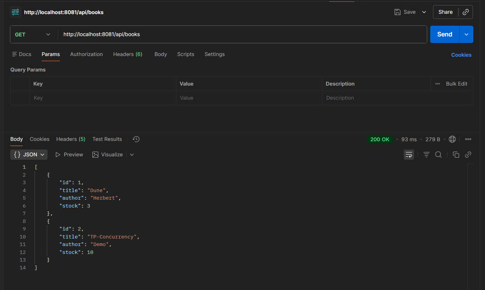
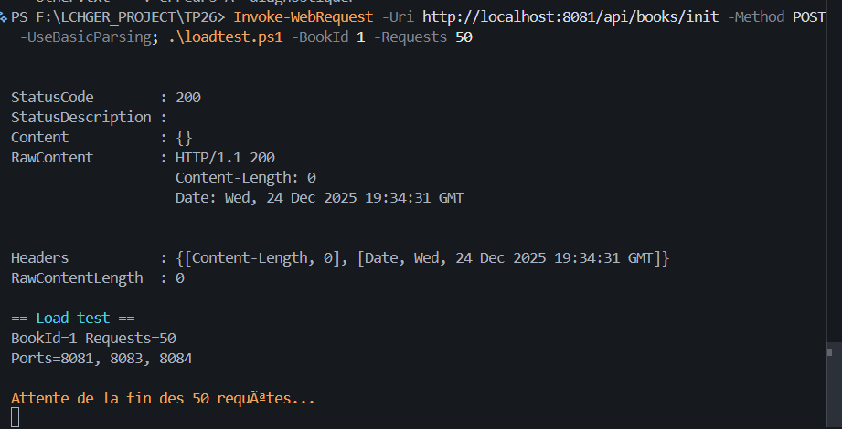
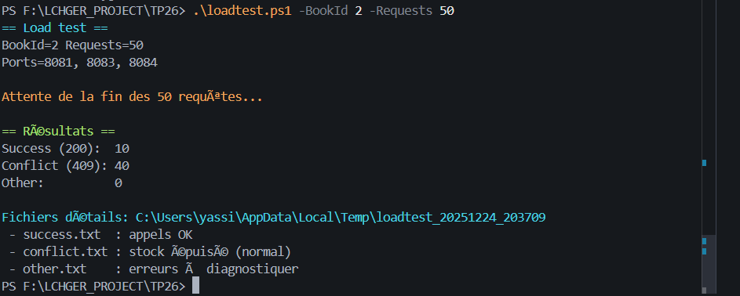
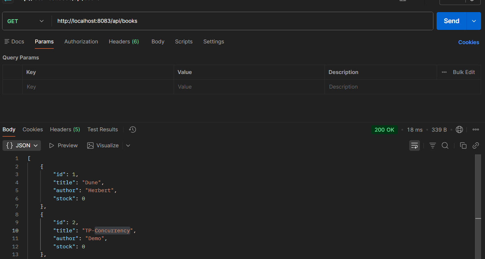
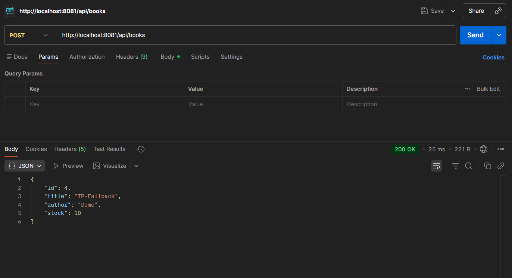
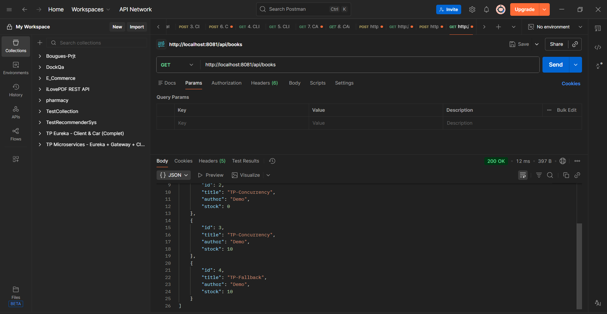
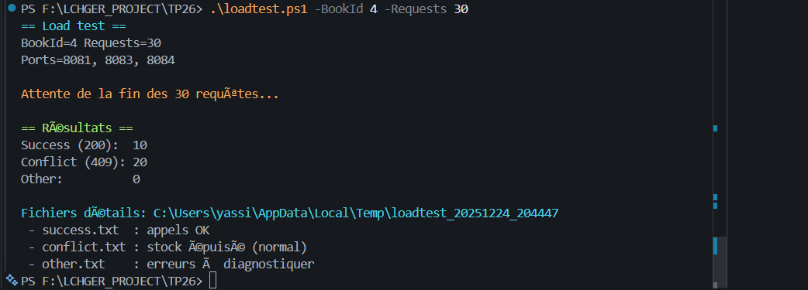
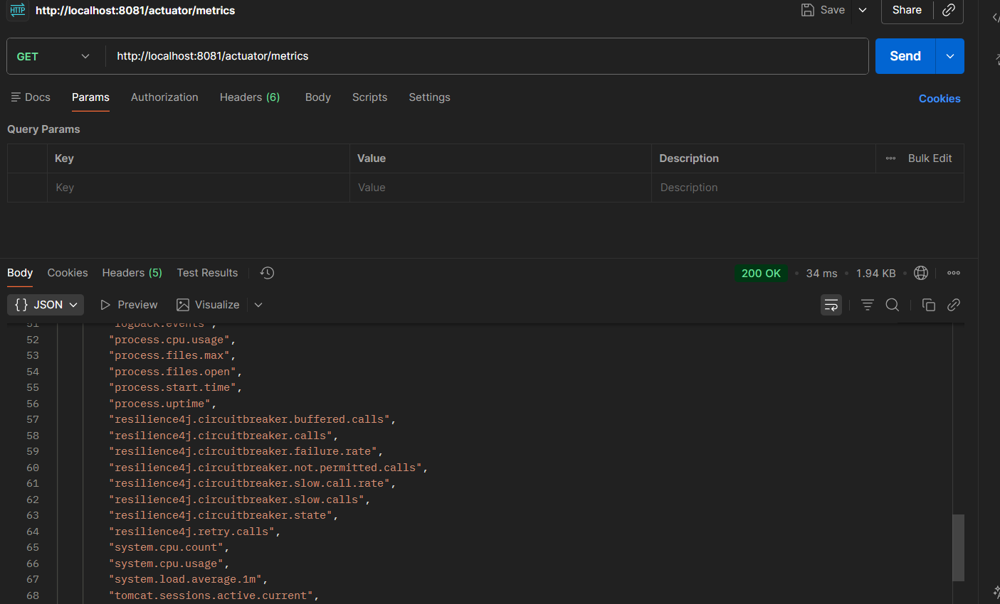

# TP 27 : Test de charge & Observabilité : Concurrence + Verrou DB + Resilience4j + Actuator Metrics

Projet de démonstration d'une architecture microservices utilisant Spring Boot, Docker et MySQL.

## 📋 Description

Ce projet implémente une architecture microservices composée de :
- **Book Service** : Service de gestion de livres (3 instances pour load balancing)
- **Pricing Service** : Service de tarification
- **MySQL** : Base de données pour la persistance des livres

## 🏗️ Architecture

```
┌─────────────────┐
│   MySQL DB      │
│   Port: 3306    │
└────────┬────────┘
         │
    ┌────┴────────────────────┐
    │                         │
┌───▼──────────┐    ┌────────▼────────┐
│ Book Service │◄───┤ Pricing Service │
│ (3 instances)│    │   Port: 8082    │
│ 8081/8083/   │    └─────────────────┘
│ 8084         │
└──────────────┘
```

## 📦 Demo


### Partie C — Test de charge : 50 emprunts en parallèle (Bash)


### Partie E — Vérifier “Stock jamais négatif” (preuve de verrou DB)

### Partie F — Résilience en charge : pricing down → fallback




### Book Service
- **Ports** : 8081, 8083, 8084 (3 instances)
- **Base de données** : MySQL (bookdb)
- **Fonctionnalités** :
  - Gestion CRUD des livres
  - Communication avec le Pricing Service
  - Endpoints Actuator pour monitoring

### Pricing Service
- **Port** : 8082
- **Fonctionnalités** :
  - Calcul et gestion des prix
  - API REST pour les tarifs
  - Endpoints Actuator pour monitoring

### MySQL
- **Port** : 3306
- **Database** : bookdb
- **User** : bookuser / bookpass
- **Root Password** : rootpass

## 🚀 Démarrage

### Prérequis

- Docker Desktop installé et démarré
- Java 21 (pour développement local)
- Maven 3.9+ (inclus via Maven Wrapper)

### Lancer tous les services

```powershell
# Depuis la racine du projet
docker-compose up -d
```

### Lancer avec rebuild

```powershell
# Rebuild toutes les images et démarrer
docker-compose up -d --build

# Rebuild un service spécifique
docker-compose build --no-cache pricing-service
docker-compose up -d --no-deps pricing-service
```

### Vérifier l'état des services

```powershell
# Status des conteneurs
docker-compose ps

# Logs d'un service
docker logs tp26-book-service-1 --tail 100
docker logs tp26-pricing-service-1 --tail 100

# Logs en temps réel
docker-compose logs -f
```

### Arrêter les services

```powershell
# Arrêter tous les services
docker-compose down

# Arrêter et supprimer les volumes
docker-compose down -v
```

## 🧪 Tests de Charge

### Test de charge : 50 emprunts en parallèle

Ce projet inclut deux scripts de test de charge pour simuler des emprunts concurrents sur les 3 instances du Book Service.

#### Version PowerShell (Windows)

```powershell
# Tester avec le livre ID 1 et 50 requêtes parallèles
.\loadtest.ps1 -BookId 1 -Requests 50

# Utiliser les valeurs par défaut (BookId=1, Requests=50)
.\loadtest.ps1
```

#### Version Bash (Linux/Mac/WSL/Git Bash)

```bash
# Rendre le script exécutable (première fois seulement)
chmod +x loadtest.sh

# Lancer le test
./loadtest.sh 1 50

# Avec valeurs par défaut
./loadtest.sh
```

#### Résultats attendus

Si le stock initial = 10 et requests = 50 :
- **Success (200)** : ≈ 10 (emprunts réussis)
- **Conflict (409)** : ≈ 40 (stock épuisé - comportement normal)
- **Other** : ≈ 0 (erreurs à diagnostiquer si > 0)

Les requêtes sont automatiquement réparties sur les 3 instances (ports 8081, 8083, 8084).

#### Interprétation des codes HTTP

- **200** : Emprunt réussi, stock décrémenté
- **409** : Plus d'exemplaires disponibles (comportement correct)
- **Other** : Problème potentiel (service down, mauvais ID, healthcheck KO, etc.)

Les détails de chaque appel sont sauvegardés dans des fichiers temporaires (chemin affiché à la fin du test).

## 🔧 Développement Local

### Compiler un service

```powershell
# Book Service
cd book-service
.\mvnw.cmd clean package -DskipTests

# Pricing Service
cd pricing-service
.\mvnw.cmd clean package -DskipTests
```

### Tests

```powershell
# Exécuter les tests
.\mvnw.cmd test
```

## 📡 Endpoints

### Book Service (Instances 1, 2, 3)
- **Instance 1** : http://localhost:8081
- **Instance 2** : http://localhost:8083
- **Instance 3** : http://localhost:8084
- **Health** : `/actuator/health`
- **API** : `/api/books`

### Pricing Service
- **URL** : http://localhost:8082
- **Health** : `/actuator/health`
- **API** : `/api/pricing`

### MySQL
- **Host** : localhost:3306
- **Database** : bookdb
- **Username** : bookuser
- **Password** : bookpass

## 🐛 Dépannage

### Le jar est corrompu (Invalid or corrupt jarfile)

```powershell
# Recompiler et rebuild l'image
cd <service-name>
.\mvnw.cmd clean package -DskipTests
cd ..
docker-compose build --no-cache <service-name>
docker-compose up -d --no-deps <service-name>
```

### Les services ne démarrent pas

```powershell
# Vérifier les logs
docker-compose logs

# Vérifier que Docker Desktop est lancé
docker ps

# Nettoyer et redémarrer
docker-compose down -v
docker-compose up -d --build
```

### Problèmes de connexion MySQL

```powershell
# Vérifier que MySQL est healthy
docker-compose ps

# Accéder à MySQL
docker exec -it tp26-mysql-1 mysql -u bookuser -pbookpass bookdb
```

## 📝 Configuration

### Application Properties

#### Book Service
- `application.yml` : Configuration par défaut
- `application-docker.yml` : Configuration pour Docker (profil activé automatiquement)

#### Pricing Service
- `application.yml` : Configuration unique

### Docker Compose

Le fichier `docker-compose.yml` définit :
- Health checks pour tous les services
- Dépendances entre services
- Volumes persistants pour MySQL
- Network bridge automatique

## 🔍 Healthchecks

Tous les services incluent des healthchecks :
- **MySQL** : `mysqladmin ping`
- **Book Service** : `curl http://localhost:8081/actuator/health`
- **Pricing Service** : `curl http://localhost:8082/actuator/health`

Les services dépendants attendent que leurs dépendances soient healthy avant de démarrer.

## 📚 Stack Technique

- **Framework** : Spring Boot 3.2.1
- **Java** : 21
- **Build Tool** : Maven 3.9.9
- **Database** : MySQL (latest)
- **Container** : Docker & Docker Compose
- **Base Image** : Eclipse Temurin 21 JRE

## 📄 Licence

Projet de démonstration pour TP26.

---

**Date de dernière mise à jour** : 24 décembre 2025
